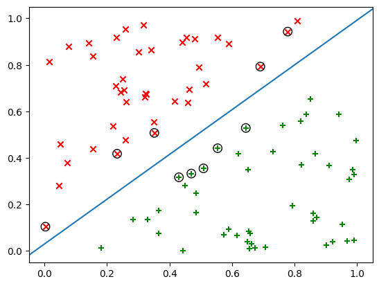

# Robust Support Vector Machines

This is an implementation of the method proposed by Xu et al.[^1] to robustify SVMs againsta outliers. Instead of using the classic hinge loss function 

$$L_{hinge}(y, \mathbf x)=[1-y\cdot f(\mathbf x)]_+ = \max\{0, 1-y\cdot f(\mathbf x)\},$$

they transform it into a bound loss function

$$L_{rhinge}(y, x)=\beta \left(1-\exp(\eta L_{hinge}(y,\mathbf x))\right),$$

which they called *rescaled hinge loss*. This new function is bounded, and thus so is the influence of possible outliers. Besides improving robustness, the effect of outliers on sparsity is also reduced. Unfortunately, the convexity of the problem is also lost. The authors propose a new training algorithm that reduces to an iterative Weighted SVM, implemented here.

A toy example is also programmed for illustration purposes. I classify uniformly sampled points in the unit square according to the diagonal line, also forcing a decently big margin. This is shown in the next image, where support vectors are circled:

Then, I add a positive example at coordinates $(-13.5, 13.5)$, that is, a gross outlier. The effect on accuracy and sparsity is shown in the following image:

Finally, the next few images illustrate the method proposed by the authors. They show the resulting SVM at each iteration, after updating the weights:

One can readily see the great improvement in accuracy and sparsity after just three iterations.

[^1]: G. Xu, Z. Cao, B.-G. Hu, and J. C. Principe, ‘Robust support vector machines based on the rescaled hinge loss function’, Pattern Recognition, vol. 63, pp. 139–148, Mar. 2017, doi: 10.1016/j.patcog.2016.09.045.

